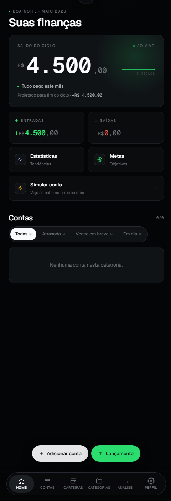

# Financas

Dashboard financeiro pessoal pra desktop. Controla contas, cartões,
parcelas, receitas recorrentes, metas e investimentos — tudo em um
único app instalável, sem servidor, sem assinatura, sem mandar nada
pra nuvem.

Chat IA local via Ollama, auto-update via GitHub Releases. Funciona
100% offline depois do primeiro boot.

> Repositório nasceu como PWA (daí o sufixo `-pwa` no nome) e
> migrou pra Electron na v1.0. Hoje o foco é o app desktop pra
> Windows.

<p align="center">
  
</p>

## Download

Baixe o instalador mais recente em
[github.com/Gstxxx/Financas-pwa/releases/latest](https://github.com/Gstxxx/Financas-pwa/releases/latest)
(`Financas Setup x.x.x.exe`, ~80 MB).

Instalação silenciosa — sem janela NSIS, abre direto. Updates futuros
descem em background e instalam quando você confirma no modal interno.

## Recursos

### Núcleo financeiro
- **Multi-conta** — corrente, poupança, dinheiro, cartão de crédito,
  investimento. Cada conta tem hue própria e ícone.
- **Cartão de crédito** com `closingDay` / `dueDay` / `creditLimit`;
  saldo = fatura aberta, barra de utilização.
- **Transferências entre contas** com atualização atômica (não
  contam como receita/despesa).
- **Parcelas** geradas automaticamente do contrato (1×, n×, ou
  recorrente sem fim).
- **Receita recorrente** — template que gera Income por mês até a
  data atual, idempotente.
- **Metas** com tipo (savings/emergency/debt-free/custom), valor-alvo
  e prazo.
- **Entidades** (pessoas/categorias) coloridas e filtráveis em todas
  as listas.

### Insights e relatórios
- **Stats** — gráficos mensais (entradas vs. saídas), top entidades,
  evolução do saldo.
- **Analysis** filtrado por entidade, persistido em localStorage.
- **Simulador** de quitação de dívidas com estratégias snowball e
  avalanche.
- **InsightsCard** no home — anomalia de gasto, projeção de saldo,
  alerta de orçamento.
- **PDF mensal** via `jspdf` exportável pelo `/stats`.
- **CSV** de transações com BOM UTF-8 (abre direto no Excel BR).

### IA local
- **Chat via Ollama** rodando local (qualquer modelo com tool support
  — testado em `llama3.1:8b` e `qwen2.5:7b`).
- **12+ tools** (`get_accounts`, `add_income`, `add_debt`,
  `mark_unpaid`, `add_account`, etc) com confirmação inline antes de
  qualquer write.
- **Floating chat button** acessível de qualquer página.
- **InsightsCard com IA** — 1 insight gerado por sessão, cache pra
  não bater no LLM toda navegação.

### Segurança e desktop polish
- **PIN de abertura** com Web Crypto + salt (PBKDF2, sem dep externa
  tipo bcrypt).
- **Backup local** em pasta escolhida (Drive / OneDrive nativo),
  auto-cleanup mantém últimos 30.
- **Notificações** de contas a vencer via main process (sobrevive a
  power resume).
- **Snooze** de notificações em 1/3/7 dias.
- **Tray menu** rico com resumo do mês, refresh a cada 5min.
- **Global hotkey** `Ctrl+Shift+F` pra abrir/focar o app de qualquer
  lugar do Windows.
- **Atalhos** `Ctrl+1..9` (8 páginas + chat), `Ctrl+N/G/I`.
- **Jump list** do Windows com ações rápidas.

## Stack

- **Electron 33** + `electron-builder` (NSIS oneClick, instalador
  silent)
- **Next.js 14** (app router, static export pra rodar dentro do
  Electron)
- **React 18** + **TypeScript 5.6**
- **better-sqlite3** pra storage local (KV simples sob o capô)
- **electron-updater** + GitHub Releases pra auto-update
- **electron-log** pra log do main process
- **jspdf** pra relatórios
- **Ollama** local pra chat IA

Zero dependência de SaaS pra funcionalidade core. Ollama é opt-in.

## Desenvolvimento

```bash
git clone https://github.com/Gstxxx/Financas-pwa
cd Financas-pwa
npm install
npm run electron:dev
```

Isso sobe Next dev server (porta 3000) + Electron apontando pra ele
com hot reload na UI.

### Comandos úteis

| Comando | O que faz |
|---|---|
| `npm run electron:dev` | Dev loop com hot reload |
| `npm run build` | Build do icon + electron + Next static |
| `npm run dist:win` | Build + empacota `.exe` em `release/` |
| `npm run release` | Build + publica no GitHub Releases (precisa `gh auth login` antes) |
| `npm run lint` | ESLint do código TypeScript |

### Estrutura

```
electron/         Main process (IPC, scheduler, updater)
src/app/          Páginas Next.js (home, debts, accounts, chat, ...)
src/components/   React components organizados por feature
src/lib/
  contexts/       FinanceContext (reducer central) + ChatContext
  services/       pluggySync, aiTools, aiInsights, pdfReport, etc
  types/          Tipos compartilhados
scripts/          build-icon.mjs, release.mjs
build/            icon.ico / icon.svg pro instalador
```

## Configuração opcional

### Ollama (chat IA)

1. Instale [Ollama](https://ollama.com) e puxe um modelo com tool
   support: `ollama pull llama3.1:8b`
2. Garanta que `ollama serve` está rodando (geralmente sobe junto
   com o app)
3. No app: `/profile` → aba **IA** → testar conexão → escolher modelo

## Release

Configurado pra publicar direto como **latest** (sem draft):

```bash
npm run release
```

`releaseType: "release"` em `package.json` faz o `electron-builder`
subir o `.exe` + `latest.yml` como release publicado.
`electron-updater` no app instalado detecta em ~8s do próximo boot.

Pré-requisito: `gh auth login` (token vem do `gh auth token`).

## Roadmap

Roadmap original (4 fases) entregue na v1.1.0. Extras desde então:
chat IA local, instalador silent, update modal customizado.

> Open Finance via Pluggy foi tentado nas v1.6-v1.7.5 e removido na
> v1.8.0 — auth do dashboard JWT vs API dev fica num escopo
> incompatível e fetch confiável de transações nunca rolou. Talvez
> volte quando alguém wire o clientId/secret path direito.

Próximas frentes possíveis:
- `Debt.accountId` — compras em CC viram lançamentos automáticos na
  fatura
- OFX import (CSV já cobre maioria dos bancos BR)
- Google Drive OAuth pra backup cross-device
- i18n (en-US) + currency configurável
- Investments com cotação automática

## Licença

Uso pessoal. Sem licença pública definida — fork à vontade pra uso
próprio, mas pra distribuir comercialmente abra uma issue antes.
